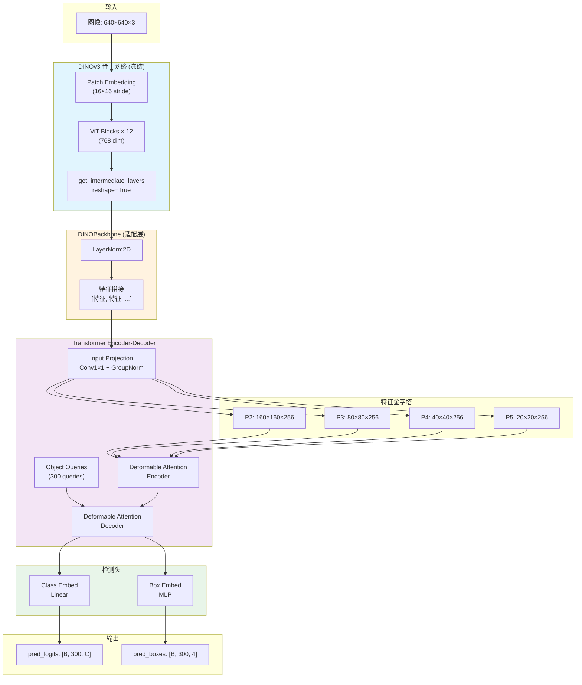
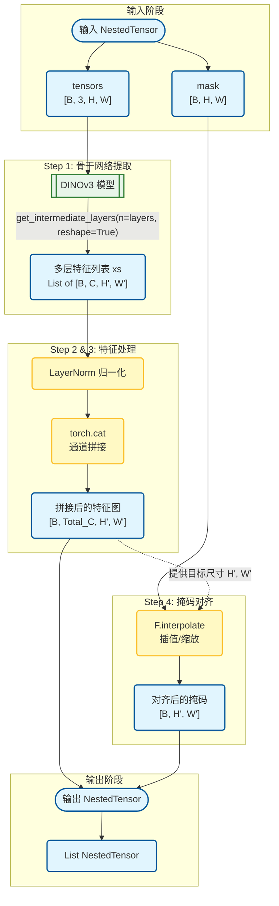

## dinov3实现目标检测的网络架构

```mermaid
flowchart TB
    subgraph Input["输入"]
        I[图像: 640×640×3]
    end

    subgraph Backbone["DINOv3 骨干网络 (冻结)"]
        B1["Patch Embedding\n(16×16 stride)"]
        B2["ViT Blocks × 12\n(768 dim)"]
        B3["get_intermediate_layers\nreshape=True"]
        
        B1 --> B2 --> B3
    end

    subgraph DINOBackbone["DINOBackbone (适配层)"]
        D1["LayerNorm2D"]
        D2["特征拼接\n[特征, 特征, ...]"]
        
        D1 --> D2
    end

    subgraph FPN["特征金字塔"]
        F1["P2: 160×160×256"]
        F2["P3: 80×80×256"]
        F3["P4: 40×40×256"]
        F4["P5: 20×20×256"]
    end

    subgraph Transformer["Transformer Encoder-Decoder"]
        T1["Input Projection\nConv1×1 + GroupNorm"]
        T2["Object Queries\n(300 queries)"]
        T3["Deformable Attention\nEncoder"]
        T4["Deformable Attention\nDecoder"]
    end

    subgraph Head["检测头"]
        H1["Class Embed\nLinear"]
        H2["Box Embed\nMLP"]
    end

    subgraph Output["输出"]
        O1["pred_logits: [B, 300, C]"]
        O2["pred_boxes: [B, 300, 4]"]
    end

    %% 连接关系
    I --> B1
    B3 --> D1
    D2 --> T1
    
    T1 --> F1
    T1 --> F2
    T1 --> F3
    T1 --> F4
    
    F1 & F2 & F3 & F4 --> T3
    T2 --> T4
    T3 --> T4
    
    T4 --> H1
    T4 --> H2
    
    H1 --> O1
    H2 --> O2

    %% 样式
    style Backbone fill:#e1f5fe
    style DINOBackbone fill:#fff3e0
    style Transformer fill:#f3e5f5
    style Head fill:#e8f5e9
```

适配层的代码实现：

```mermaid
graph TD
    %% 定义样式
    classDef data fill:#e1f5fe,stroke:#01579b,stroke-width:2px,rx:5,ry:5;
    classDef proc fill:#fff9c4,stroke:#fbc02d,stroke-width:2px,rx:5,ry:5;
    classDef model fill:#e8f5e9,stroke:#2e7d32,stroke-width:2px,rx:5,ry:5;

    %% 1. 输入部分
    subgraph Input_Stage [输入阶段]
        InputNT([输入 NestedTensor]):::data
        InputImg["tensors <br/> [B, 3, H, W]"]:::data
        InputMask["mask <br/> [B, H, W]"]:::data
        
        InputNT --> InputImg
        InputNT --> InputMask
    end

    %% 2. 骨干网络处理
    subgraph Backbone_Stage [Step 1: 骨干网络提取]
        DINO[[DINOv3 模型]]:::model
        Feats["多层特征列表 xs <br/> List of [B, C, H', W']"]:::data
        
        InputImg --> DINO
        DINO -- "get_intermediate_layers(n=layers, reshape=True)" --> Feats
    end

    %% 3. 特征后处理
    subgraph Feature_Proc [Step 2 & 3: 特征处理]
        LN[LayerNorm 归一化]:::proc
        Concat["torch.cat <br/> 通道拼接"]:::proc
        FusedFeat["拼接后的特征图 <br/> [B, Total_C, H', W']"]:::data
        
        Feats --> LN
        LN --> Concat
        Concat --> FusedFeat
    end

    %% 4. 掩码处理
    subgraph Mask_Proc [Step 4: 掩码对齐]
        Interp["F.interpolate <br/> 插值/缩放"]:::proc
        NewMask["对齐后的掩码 <br/> [B, H', W']"]:::data
        
        InputMask --> Interp
        FusedFeat -.->|提供目标尺寸 H', W'| Interp
        Interp --> NewMask
    end

    %% 5. 输出封装
    subgraph Output_Stage [输出阶段]
        OutNT([输出 NestedTensor]):::data
        Result[List NestedTensor]:::data
        
        FusedFeat --> OutNT
        NewMask --> OutNT
        OutNT --> Result
    end
```